### A library to create syntax ("railroad") diagrams as Scalable Vector Graphics (SVG).


[](https://github.com/lukaslueg/railroad/actions/workflows/check.yml)
[](https://crates.io/crates/railroad)
[](https://docs.rs/railroad)

**[Live demo](https://lukaslueg.github.io/macro_railroad_wasm_demo/)** ([code](https://github.com/lukaslueg/macro_railroad_wasm))
**[Some examples](https://htmlpreview.github.io/?https://github.com/lukaslueg/railroad_dsl/blob/master/examples/example_diagrams.html)** using a small [DSL of it's own](https://github.com/lukaslueg/railroad_dsl).


Railroad diagrams are a way to represent context-free grammar. Every diagram has exactly one starting- and end-point; everything that belongs to the described language is represented by one of the possible paths between those points.

Using this library, diagrams are created using primitives which implement `Node`. Primitives are combined into more complex structures by wrapping simple elements into more complex ones. The public API stays flat at the crate root, so built-in nodes such as `Sequence`, `Choice`, `Terminal`, `Optional`, and `Diagram` are all available directly from `railroad::*`.


```rust
use railroad::*;

let mut seq: Sequence<Box<dyn Node>> = Sequence::default();
seq.push(Box::new(Start))
   .push(Box::new(Terminal::new("BEGIN".to_owned())))
   .push(Box::new(NonTerminal::new("syntax".to_owned())))
   .push(Box::new(End));

let dia = Diagram::new_with_stylesheet(seq, &Stylesheet::Light);
println!("{}", dia);
```


<!-- BEGIN GENERATED VISUAL VOCABULARY -->

## Visual vocabulary

Follow a path from start to end. Read literal tokens along the path, expand named rules, and follow the arrows around branches and loops.

The examples below use `SimpleStart` and `SimpleEnd` around each connected pattern. Expand **Rust** to see the node inside those markers; grids and the marker examples show their complete node trees.

---

**Reading the rails**

These patterns describe what a grammar accepts.

### Literal token — `Terminal`

Consume exactly the token `if`.


<details>
<summary>Rust</summary>

```rust
use railroad::*;

let node = Terminal::new("if".to_owned());
```

</details>

### Another rule — `NonTerminal`

Expand the named rule `expr`.


<details>
<summary>Rust</summary>

```rust
use railroad::*;

let node = NonTerminal::new("expr".to_owned());
```

</details>

### In order — `Sequence`

Consume `(`, an expression, and `)` in order.


<details>
<summary>Rust</summary>

```rust
use railroad::*;

let node = Sequence::<Box<dyn Node>>::new(vec![
    Box::new(Terminal::new("(".to_owned())),
    Box::new(NonTerminal::new("expr".to_owned())),
    Box::new(Terminal::new(")".to_owned())),
]);
```

</details>

### Choose one — `Choice`

Choose exactly one alternative: `true` or `false`.


<details>
<summary>Rust</summary>

```rust
use railroad::*;

let node = Choice::new(vec![
    Terminal::new("true".to_owned()),
    Terminal::new("false".to_owned()),
]);
```

</details>

### Take it or skip it — `Optional`

Consume `else`, or take the upper bypass and consume nothing.


<details>
<summary>Rust</summary>

```rust
use railroad::*;

let node = Optional::new(Terminal::new("else".to_owned()));
```

</details>

### One or more — `Repeat`

Consume one or more items using the lower return path.

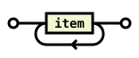

<details>
<summary>Rust</summary>

```rust
use railroad::*;

let node = Repeat::new(NonTerminal::new("item".to_owned()), Empty);
```

</details>

### Zero or more — `Optional` + `Repeat`

Skip all items via the upper bypass, or consume one or more via the lower loop.

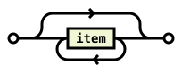

<details>
<summary>Rust</summary>

```rust
use railroad::*;

let node = Optional::new(Repeat::new(NonTerminal::new("item".to_owned()), Empty));
```

</details>

### Separated list — `Repeat`

Consume one or more comma-separated items, without a leading or trailing comma.

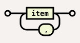

<details>
<summary>Rust</summary>

```rust
use railroad::*;

let node = Repeat::new(
    NonTerminal::new("item".to_owned()),
    Terminal::new(",".to_owned()),
);
```

</details>

---

**Annotations and assertion recipes**

Annotations connect a checkpoint to a detached LabeledBox. Wavy arrows refer ahead or behind in the local reading direction. Labels and grammar meaning are supplied by the author; the following assertions are recipes.

### Attach a note — `Annotation`

Attach a caller-supplied label and body to a plain checkpoint. This annotation supplies no automatic grammar wording.

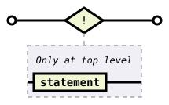

<details>
<summary>Rust</summary>

```rust
use railroad::*;

let node = Annotation::new(LabeledBox::new(
    NonTerminal::new("statement".to_owned()),
    Comment::new("Only at top level".to_owned()),
));
```

</details>

### Negative lookahead recipe — `Annotation::new_ahead`

Consume one ASCII character if the upcoming input does not start with a quote, backslash, or CR. The assertion itself consumes no input.

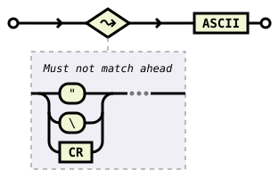

<details>
<summary>Rust</summary>

```rust
use railroad::*;

let node = Sequence::<Box<dyn Node>>::new(vec![
    Box::new(Annotation::new_ahead(LabeledBox::new(
        Choice::<Box<dyn Node>>::new(vec![
            Box::new(Terminal::new("\"".to_owned())),
            Box::new(Terminal::new("\\".to_owned())),
            Box::new(NonTerminal::new("CR".to_owned())),
        ]),
        Comment::new("Must not match ahead; consumes no input".to_owned()),
    ))),
    Box::new(NonTerminal::new("ASCII".to_owned())),
]);
```

</details>

### Negative lookbehind recipe — `Annotation::new_behind`

Match a decimal integer, then reject exactly `0`. `START_OF_INPUT` denotes a zero-width input boundary, so `10` and `20` still pass the lookbehind. The assertion itself consumes no input.


<details>
<summary>Rust</summary>

```rust
use railroad::*;

let node = Sequence::<Box<dyn Node>>::new(vec![
    Box::new(NonTerminal::new("DECIMAL".to_owned())),
    Box::new(Annotation::new_behind(LabeledBox::new(
        Sequence::<Box<dyn Node>>::new(vec![
            Box::new(NonTerminal::new("START_OF_INPUT".to_owned())),
            Box::new(Terminal::new("0".to_owned())),
        ]),
        Comment::new("Must not match behind; consumes no input".to_owned()),
    ))),
]);
```

</details>

---

**Arranging the diagram**

Stacks and choices connect their children; grids arrange independent diagrams.

### Continue on another row — `Stack`

Read the same `(`, expression, `)` sequence across connected rows.


<details>
<summary>Rust</summary>

```rust
use railroad::*;

let node = Stack::<Box<dyn Node>>::new(vec![
    Box::new(Terminal::new("(".to_owned())),
    Box::new(NonTerminal::new("expr".to_owned())),
    Box::new(Terminal::new(")".to_owned())),
]);
```

</details>

### Spread alternatives across columns — `MultiChoice`

Choose one of four alternatives spread across two columns: `true`, `false`, `null`, or `undefined`.


<details>
<summary>Rust</summary>

```rust
use railroad::*;

let node = MultiChoice::new(vec![
    vec![
        Terminal::new("true".to_owned()),
        Terminal::new("false".to_owned()),
    ],
    vec![
        Terminal::new("null".to_owned()),
        Terminal::new("undefined".to_owned()),
    ],
]);
```

</details>

### Independent rows — `VerticalGrid`

Place independent diagrams above one another, with no connecting path.

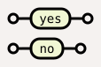

<details>
<summary>Rust</summary>

```rust
use railroad::*;

let node = VerticalGrid::new(vec![
    Sequence::<Box<dyn Node>>::new(vec![
        Box::new(SimpleStart),
        Box::new(Terminal::new("yes".to_owned())),
        Box::new(SimpleEnd),
    ]),
    Sequence::<Box<dyn Node>>::new(vec![
        Box::new(SimpleStart),
        Box::new(Terminal::new("no".to_owned())),
        Box::new(SimpleEnd),
    ]),
]);
```

</details>

### Independent columns — `HorizontalGrid`

Place the same independent diagrams beside one another.

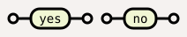

<details>
<summary>Rust</summary>

```rust
use railroad::*;

let node = HorizontalGrid::new(vec![
    Sequence::<Box<dyn Node>>::new(vec![
        Box::new(SimpleStart),
        Box::new(Terminal::new("yes".to_owned())),
        Box::new(SimpleEnd),
    ]),
    Sequence::<Box<dyn Node>>::new(vec![
        Box::new(SimpleStart),
        Box::new(Terminal::new("no".to_owned())),
        Box::new(SimpleEnd),
    ]),
]);
```

</details>

---

**Explaining and navigating**

Annotations and links help readers interpret a diagram without adding grammar tokens.

### Add an annotation — `Comment`

Show explanatory text along the path, without consuming a token.


<details>
<summary>Rust</summary>

```rust
use railroad::*;

let node = Comment::new("an expression follows".to_owned());
```

</details>

### Label a group — `LabeledBox`

Explain a group with a labeled box around its node.

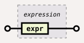

<details>
<summary>Rust</summary>

```rust
use railroad::*;

let node = LabeledBox::new(
    NonTerminal::new("expr".to_owned()),
    Comment::new("expression".to_owned()),
);
```

</details>

### Make a node clickable — `Link`

Link a node to documentation. Open the SVG directly or embed it inline to use the link.

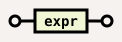

<details>
<summary>Rust</summary>

```rust
use railroad::*;

let node = Link::new(
    NonTerminal::new("expr".to_owned()),
    "https://docs.rs/railroad/latest/railroad/struct.NonTerminal.html".to_owned(),
);
```

</details>

### Mark the boundaries — `Start` and `End`

Vertical bars mark the beginning and end of a complete diagram.


<details>
<summary>Rust</summary>

```rust
use railroad::*;

let node = Sequence::<Box<dyn Node>>::new(vec![
    Box::new(Start),
    Box::new(NonTerminal::new("expr".to_owned())),
    Box::new(End),
]);
```

</details>

### Compact boundaries — `SimpleStart` and `SimpleEnd`

Circles provide compact start and end markers.

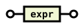

<details>
<summary>Rust</summary>

```rust
use railroad::*;

let node = Sequence::<Box<dyn Node>>::new(vec![
    Box::new(SimpleStart),
    Box::new(NonTerminal::new("expr".to_owned())),
    Box::new(SimpleEnd),
]);
```

</details>

### Draw nothing — `Empty`

Use `Empty` where a node is required but no input is consumed. Here it fills the inner node of the labeled first alternative.


<details>
<summary>Rust</summary>

```rust
use railroad::*;

let node = Choice::<Box<dyn Node>>::new(vec![
    Box::new(LabeledBox::new(
        Empty,
        Comment::new("Default".to_owned()),
    )),
    Box::new(Terminal::new("ASC".to_owned())),
    Box::new(Terminal::new("DESC".to_owned())),
]);
```

</details>

<!--
Generated by examples/readme.rs.
Regenerate: cargo run --no-default-features --example readme
Check: cargo run --no-default-features --example readme -- --check
-->
<!-- END GENERATED VISUAL VOCABULARY -->

---

## Implementing [`Node`](https://docs.rs/railroad/latest/railroad/trait.Node.html)

For simple custom nodes, implementing `entry_height()`, `height()`, `width()`, and `draw()` is often enough. A custom node must only draw within the geometry it advertises, and its connecting path must stay at `y + entry_height()`. Composite or performance-sensitive nodes should usually override `compute_geometry()` and the geometry-aware draw/render hooks so child geometry is computed once and reused.

The lower-level SVG helpers are available as `railroad::svg`. Downstream crates can use them to build custom `Node` implementations while still exposing their nodes through the regular `railroad` API.

When adding new `Node` primitives to this library, `examples/visuals.rs` is a useful manual harness for generating edge cases and checking layout. Use the `visual-debug` feature to add guide lines to the rendered diagram and extra metadata to the SVG output.

See https://docs.rs for more information.

---

## Themes

This library comes with a set of pre-defined [themes](https://docs.rs/railroad/latest/railroad/enum.Stylesheet.html). Existing themes can be modified and custom themes can be created using CSS.

### Default light
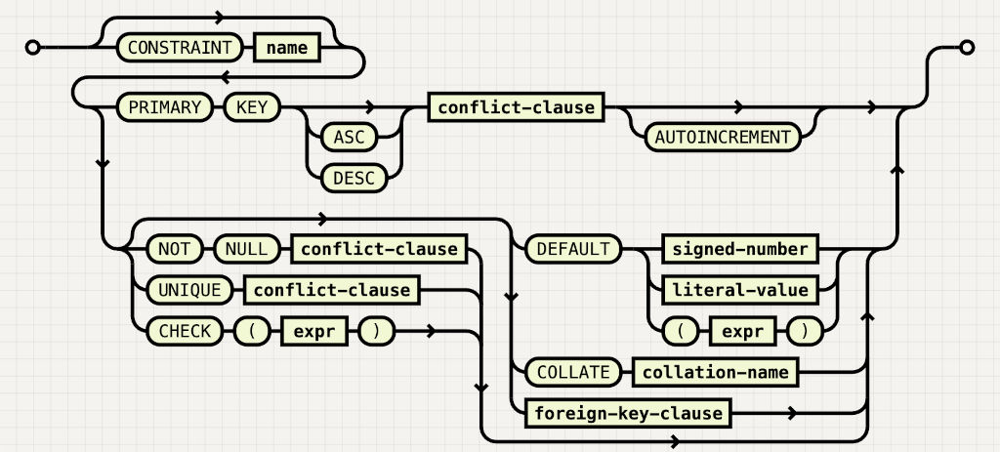

### Default dark
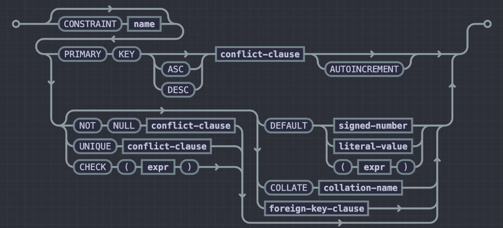

### Rust
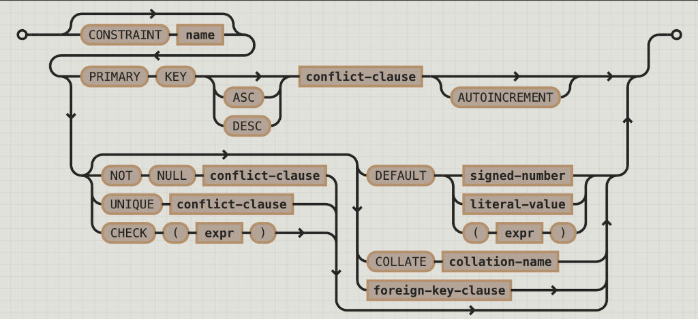

### Coal
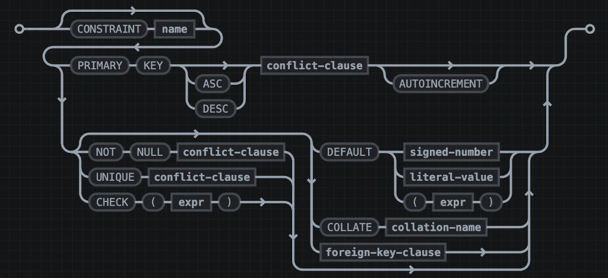

### Navy
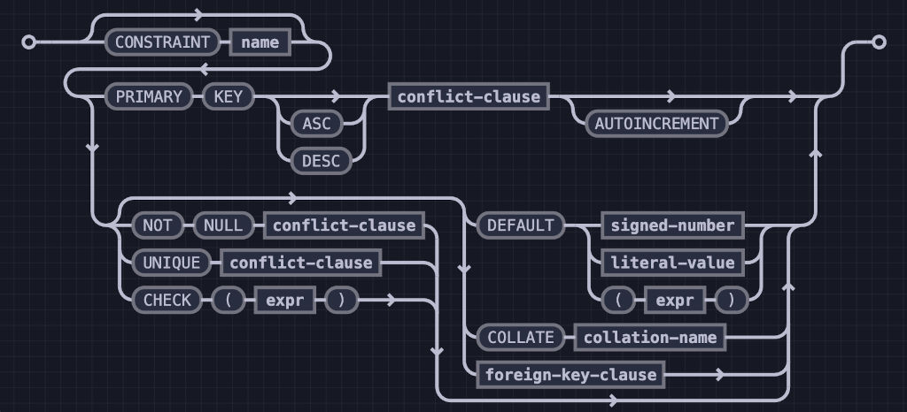

### Ayu
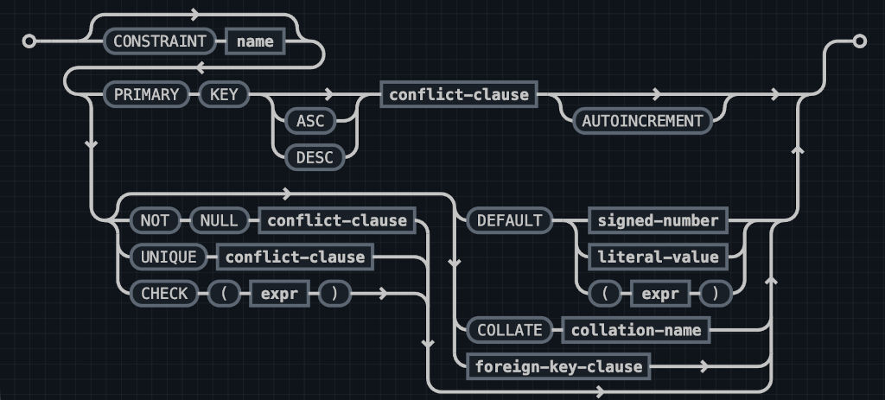
