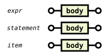
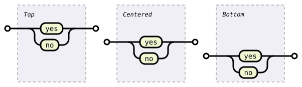

### A library to create syntax ("railroad") diagrams as Scalable Vector Graphics (SVG).


[](https://github.com/lukaslueg/railroad/actions/workflows/check.yml)
[](https://crates.io/crates/railroad)
[](https://docs.rs/railroad)

**[Live demo](https://lukaslueg.github.io/macro_railroad_wasm_demo/)** ([code](https://github.com/lukaslueg/macro_railroad_wasm))
**[Some examples](https://htmlpreview.github.io/?https://github.com/lukaslueg/railroad_dsl/blob/master/examples/example_diagrams.html)** using a small [DSL of its own](https://github.com/lukaslueg/railroad_dsl).


Railroad diagrams represent grammar rules as paths from a start point to an end point. Each path describes a sequence accepted by the rule.

Build diagrams by combining nodes such as `Terminal`, `Sequence`, and `Choice`. All built-in nodes are available at the crate root.


```rust
use railroad::*;

let mut seq: Sequence<Box<dyn Node>> = Sequence::default();
seq.push(Box::new(Start))
   .push(Box::new(Terminal::new("BEGIN".to_owned())))
   .push(Box::new(NonTerminal::new("syntax".to_owned())))
   .push(Box::new(End));

let dia = Diagram::new_with_stylesheet(seq, &Stylesheet::Light);
println!("{}", dia);
```


<!-- BEGIN GENERATED VISUAL VOCABULARY -->

## Visual vocabulary

Follow a path from start to end. Read literal tokens along the path, expand named rules, and follow the arrows around branches and loops.

---

**Tokens and control flow**

Tokens, sequences, alternatives, and repetitions.

### Literal token — `Terminal`

Consume exactly the token `if`.


<details>
<summary>Rust</summary>

```rust
use railroad::*;

let node = Terminal::new("if".to_owned());
```

</details>

### Named rule — `NonTerminal`

Expand the named rule `expr`.


<details>
<summary>Rust</summary>

```rust
use railroad::*;

let node = NonTerminal::new("expr".to_owned());
```

</details>

### Ordered sequence — `Sequence`

Consume `(`, an expression, and `)` in order.


<details>
<summary>Rust</summary>

```rust
use railroad::*;

let node = Sequence::<Box<dyn Node>>::new(vec![
    Box::new(Terminal::new("(".to_owned())),
    Box::new(NonTerminal::new("expr".to_owned())),
    Box::new(Terminal::new(")".to_owned())),
]);
```

</details>

### Alternatives — `Choice`

Choose exactly one alternative: `true` or `false`.


<details>
<summary>Rust</summary>

```rust
use railroad::*;

let node = Choice::new(vec![
    Terminal::new("true".to_owned()),
    Terminal::new("false".to_owned()),
]);
```

</details>

### Optional element — `Optional`

Consume `else`, or take the upper bypass and consume nothing.


<details>
<summary>Rust</summary>

```rust
use railroad::*;

let node = Optional::new(Terminal::new("else".to_owned()));
```

</details>

### One or more — `Repeat`

Consume one or more items using the lower return path.


<details>
<summary>Rust</summary>

```rust
use railroad::*;

let node = Repeat::new(NonTerminal::new("item".to_owned()), Empty);
```

</details>

### Zero or more — `Optional` + `Repeat`

Skip all items via the upper bypass, or consume one or more via the lower loop.


<details>
<summary>Rust</summary>

```rust
use railroad::*;

let node = Optional::new(Repeat::new(NonTerminal::new("item".to_owned()), Empty));
```

</details>

### Separated list — `Repeat`

Consume one or more comma-separated items, without a leading or trailing comma.


<details>
<summary>Rust</summary>

```rust
use railroad::*;

let node = Repeat::new(
    NonTerminal::new("item".to_owned()),
    Terminal::new(",".to_owned()),
);
```

</details>

---

**Annotations and assertions**

`Annotation` connects a checkpoint to any node below the path. Use `LabeledBox` to add a border and label. Its marker can point ahead or behind in the reading direction. The examples below use these markers to illustrate lookahead and lookbehind assertions.

### Attach a note — `Annotation`

Connect a checkpoint to a labeled box below the path.


<details>
<summary>Rust</summary>

```rust
use railroad::*;

let node = Annotation::new(LabeledBox::new(
    NonTerminal::new("statement".to_owned()),
    Comment::new("Only at top level".to_owned()),
));
```

</details>

### Example: negative lookahead — `Annotation::new_ahead`

Consume one ASCII character if the upcoming input does not start with a quote, backslash, or CR. The assertion itself consumes no input.


<details>
<summary>Rust</summary>

```rust
use railroad::*;

let node = Sequence::<Box<dyn Node>>::new(vec![
    Box::new(Annotation::new_ahead(LabeledBox::new(
        Sequence::<Box<dyn Node>>::new(vec![
            Box::new(Choice::<Box<dyn Node>>::new(vec![
                Box::new(Terminal::new("\"".to_owned())),
                Box::new(Terminal::new("\\".to_owned())),
                Box::new(NonTerminal::new("CR".to_owned())),
            ])),
            Box::new(Continuation)]),
        Comment::new("Must not match ahead".to_owned()),
    ))),
    Box::new(NonTerminal::new("ASCII".to_owned())),
]);
```

</details>

### Example: negative lookbehind — `Annotation::new_behind`

Match a decimal integer, then reject exactly `0`.


<details>
<summary>Rust</summary>

```rust
use railroad::*;

let node = Sequence::<Box<dyn Node>>::new(vec![
    Box::new(NonTerminal::new("DECIMAL".to_owned())),
    Box::new(Annotation::new_behind(LabeledBox::new(
        Sequence::<Box<dyn Node>>::new(vec![
            Box::new(Continuation),
            Box::new(Terminal::new("0".to_owned())),
        ]),
        Comment::new("Must not match behind".to_owned()),
    ))),
]);
```

</details>

---

**Layout**

Stacks and choices connect their children; grids arrange independent diagrams.

### Continue on another row — `Stack`

Read the same `(`, expression, `)` sequence across connected rows.


<details>
<summary>Rust</summary>

```rust
use railroad::*;

let node = Stack::<Box<dyn Node>>::new(vec![
    Box::new(Terminal::new("(".to_owned())),
    Box::new(NonTerminal::new("expr".to_owned())),
    Box::new(Terminal::new(")".to_owned())),
]);
```

</details>

### Alternatives in columns — `MultiChoice`

Choose one of four alternatives spread across two columns: `true`, `false`, `null`, or `undefined`.


<details>
<summary>Rust</summary>

```rust
use railroad::*;

let node = MultiChoice::new(vec![
    vec![
        Terminal::new("true".to_owned()),
        Terminal::new("false".to_owned()),
    ],
    vec![
        Terminal::new("null".to_owned()),
        Terminal::new("undefined".to_owned()),
    ],
]);
```

</details>

### Independent rows — `VerticalGrid`

Place independent diagrams above one another, with no connecting path.


<details>
<summary>Rust</summary>

```rust
use railroad::*;

let node = VerticalGrid::new(vec![
    Sequence::<Box<dyn Node>>::new(vec![
        Box::new(SimpleStart),
        Box::new(Terminal::new("yes".to_owned())),
        Box::new(SimpleEnd),
    ]),
    Sequence::<Box<dyn Node>>::new(vec![
        Box::new(SimpleStart),
        Box::new(Terminal::new("no".to_owned())),
        Box::new(SimpleEnd),
    ]),
]);
```

</details>

### Independent columns — `HorizontalGrid`

Place the same independent diagrams beside one another.


<details>
<summary>Rust</summary>

```rust
use railroad::*;

let node = HorizontalGrid::new(vec![
    Sequence::<Box<dyn Node>>::new(vec![
        Box::new(SimpleStart),
        Box::new(Terminal::new("yes".to_owned())),
        Box::new(SimpleEnd),
    ]),
    Sequence::<Box<dyn Node>>::new(vec![
        Box::new(SimpleStart),
        Box::new(Terminal::new("no".to_owned())),
        Box::new(SimpleEnd),
    ]),
]);
```

</details>

### Shared label column — `Alignment`

Reserve equal widths for rule labels so each diagram body begins at the same horizontal position.



<details>
<summary>Rust</summary>

```rust
use railroad::*;

let node = {
    let labels = ["expr", "statement", "item"].map(|text| Comment::new(text.to_owned()));
    let column_width = labels.iter().map(Node::width).max().unwrap_or(0);
    let rows = labels.into_iter().map(|label| {
        HorizontalGrid::<Box<dyn Node>>::new(vec![
            Box::new(Alignment::new(
                label,
                column_width,
                0,
                HorizontalAlignment::Start,
                VerticalAlignment::Top,
                false,
            )),
            Box::new(Sequence::<Box<dyn Node>>::new(vec![
                Box::new(SimpleStart),
                Box::new(NonTerminal::new("body".to_owned())),
                Box::new(SimpleEnd),
            ])),
        ])
    });
    rows.collect::<VerticalGrid<_>>()
};
```

</details>

### Vertical alignment — `Alignment`

Place a choice at the top, center, or bottom of equal-height boxes. The choice keeps its natural size, and its connecting rail moves with it.



<details>
<summary>Rust</summary>

```rust
use railroad::*;

let node = {
    let placements = [
        (VerticalAlignment::Top, "Top"),
        (VerticalAlignment::Centered, "Centered"),
        (VerticalAlignment::Bottom, "Bottom"),
    ];
    placements.into_iter().map(|(vertical, label)| {
        Sequence::<Box<dyn Node>>::new(vec![
            Box::new(SimpleStart),
            Box::new(LabeledBox::new(
                Alignment::new(
                    Choice::new(vec![
                        Terminal::new("yes".to_owned()),
                        Terminal::new("no".to_owned()),
                    ]),
                    120,
                    110,
                    HorizontalAlignment::Centered,
                    vertical,
                    true,
                ),
                Comment::new(label.to_owned()),
            )),
            Box::new(SimpleEnd),
        ])
    }).collect::<HorizontalGrid<_>>()
};
```

</details>

### Scale a subtree — `Scale`

Enlarge the inline comment and shrink the return-path comment, keeping their connecting rails aligned.


<details>
<summary>Rust</summary>

```rust
use railroad::*;

let node = Repeat::new(
    Scale::new(Comment::new("Scaled up".to_owned()), 1.5),
    Scale::new(Comment::new("Scaled down".to_owned()), 0.75),
);
```

</details>

---

**Labels, links, and markers**

Add explanatory text, hyperlinks, and start, end, or omission markers.

### Explanatory text — `Comment`

Show explanatory text along the path, without consuming a token.


<details>
<summary>Rust</summary>

```rust
use railroad::*;

let node = Comment::new("an expression follows".to_owned());
```

</details>

### Label a group — `LabeledBox`

Draw a box around a node, with a label above it.


<details>
<summary>Rust</summary>

```rust
use railroad::*;

let node = LabeledBox::new(
    NonTerminal::new("expr".to_owned()),
    Comment::new("expression".to_owned()),
);
```

</details>

### Make a node clickable — `Link`

Link a node to documentation. Open the SVG directly or embed it inline to use the link.


<details>
<summary>Rust</summary>

```rust
use railroad::*;

let node = Link::new(
    NonTerminal::new("expr".to_owned()),
    "https://docs.rs/railroad/latest/railroad/struct.NonTerminal.html".to_owned(),
);
```

</details>

### Mark the boundaries — `Start` and `End`

Vertical bars mark the beginning and end of a complete diagram.


<details>
<summary>Rust</summary>

```rust
use railroad::*;

let node = Sequence::<Box<dyn Node>>::new(vec![
    Box::new(Start),
    Box::new(NonTerminal::new("expr".to_owned())),
    Box::new(End),
]);
```

</details>

### Compact boundaries — `SimpleStart` and `SimpleEnd`

Circles provide compact start and end markers.


<details>
<summary>Rust</summary>

```rust
use railroad::*;

let node = Sequence::<Box<dyn Node>>::new(vec![
    Box::new(SimpleStart),
    Box::new(NonTerminal::new("expr".to_owned())),
    Box::new(SimpleEnd),
]);
```

</details>

### Show a fragment — `ContinuationStart` and `ContinuationEnd`

Three dots mark omitted portions before and after the fragment.


<details>
<summary>Rust</summary>

```rust
use railroad::*;

let node = Sequence::<Box<dyn Node>>::new(vec![
    Box::new(ContinuationStart),
    Box::new(NonTerminal::new("expr".to_owned())),
    Box::new(ContinuationEnd),
]);
```

</details>

### Omit a section — `Continuation`

An ellipsis marks an omitted section.


<details>
<summary>Rust</summary>

```rust
use railroad::*;

let node = Sequence::<Box<dyn Node>>::new(vec![
    Box::new(Terminal::new("BEGIN".to_owned())),
    Box::new(Continuation),
    Box::new(Terminal::new("END".to_owned())),
]);
```

</details>

### Draw nothing — `Empty`

Use `Empty` where a node is required but no input is consumed. The first alternative contains a label but no token.


<details>
<summary>Rust</summary>

```rust
use railroad::*;

let node = Choice::<Box<dyn Node>>::new(vec![
    Box::new(LabeledBox::new(
        Empty,
        Comment::new("Default".to_owned()),
    )),
    Box::new(Terminal::new("ASC".to_owned())),
    Box::new(Terminal::new("DESC".to_owned())),
]);
```

</details>

<!--
Generated by examples/readme.rs.
Regenerate: cargo run --no-default-features --example readme
Check: cargo run --no-default-features --example readme -- --check
-->
<!-- END GENERATED VISUAL VOCABULARY -->

---

## Implementing [`Node`](https://docs.rs/railroad/latest/railroad/trait.Node.html)

Custom nodes must draw within their reported bounds, with the connecting path at `y + entry_height()`. Leaf nodes need to implement `entry_height()`, `height()`, `width()`, and `draw()`. Composite nodes can override `compute_geometry()`, `draw_with_geometry()`, and `render_with_geometry()` to compute child geometry once and reuse it during rendering.

Use `railroad::svg` to construct SVG elements and paths. See the [crate documentation](https://docs.rs/railroad/latest/railroad/) for the full API.

## Developing nodes

Run `cargo run --example visuals` to generate `examples/visuals.html` for manual layout checks. Add cases to `examples/visuals.rs` when developing a node. Enable the `visual-debug` feature to show guide lines and include geometry metadata in the SVG.

## Validation

The test suite validates SVG test cases against the W3C SVG 1.1 DTD and all bundled CSS stylesheets with the Nu Html Checker. A validation failure caused by the library's provided nodes, rendering methods, or bundled stylesheets is considered a bug and should be reported as such.

---

## Themes

Choose a built-in [theme](https://docs.rs/railroad/latest/railroad/enum.Stylesheet.html) or add custom CSS with `Diagram::add_css`.

### Default light


### Default dark


### Rust


### Coal


### Navy


### Ayu

